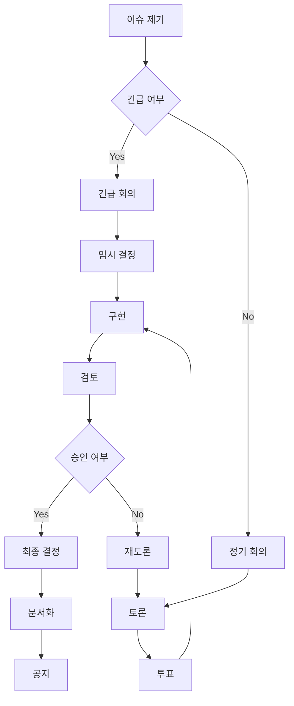

# UEM 관리 시스템 v1.0: 버전/증명/작업/체계 관리
> **목적**: UEM 프로젝트의 지속적인 증명, 개발, 연구를 위한 통합 관리 시스템
> **적용**: 버전 관리, 증명 추적, 작업 관리, 체계 관리의 전체 프로세스
> **사용자**: 개발자, 연구자, 증명 담당자, 프로젝트 관리자

---

## 1. 버전 관리 시스템

### 1.1 버전 명명 규칙
```
형식: UEM_[MAJOR].[MINOR].[PATCH]_[DATE]
- MAJOR: 주요 아키텍처 변경 (0, 1, 2...)
- MINOR: 새로운 기능/스펙 추가 (0-9)
- PATCH: 버그 수정/작업 개선 (0-9)
- DATE: YYYY-MM-DD

예시: UEM_1.2.3_2025-12-08
```

### 1.2 버전 유형 분류

#### 스펙 버전 (Spec Versions)
- **v3.1_2025-03**: 현재 최신 스펙 (Part I/II/III 복원)
- **v3.0**: 레거시 스펙 (포인터로 연결)
- **v2.x**: 이전 철학적 기반 (보관용)

#### 구현 버전 (Implementation Versions)
- **Lean 버전**: `lean --version` 호환성 기록
- **Mathlib 버전**: `.lake/packages/mathlib/` 버전 추적
- **Lake 버전**: 빌드 시스템 호환성

#### 통합본 버전 (Master Versions)
- **v1.0_2025-12-08**: 첫 통합본
- **v1.x**: 지속적 업데이트

### 1.3 버전 관리 절차

#### 릴리즈 절차
```bash
# 1. 현재 상태 확인
cd /Users/a/dev/UEM && git status

# 2. 버전 태그 생성
git tag -a UEM_v1.1.0_2025-12-15 -m "Release v1.1.0: 한글 연산자 LUT 완성"

# 3. CHANGELOG.md 업데이트
echo "# UEM v1.1.0 Release Notes (2025-12-15)

## 변경 사항
- 한글 연산자 LUT 완성 (19초성+21중성+28종성)
- P3-P4 정리 증명 완료
- 차원 독립성 lemma 5개 추가

## 버그 수정
- margin 로그 갱신 규약 오류 수정
- Lean 4.26.0 호환성 개선

## 다음 버전 계획
- KM-1~3 증명 시작
- HS 서브셋 정의 확정" >> CHANGELOG.md

# 4. 커밋
git add .
git commit -m "Release UEM v1.1.0: 한글 연산자 완성"
git push origin main --tags
```

#### 브랜치 전략
```bash
# 메인 브랜치
main          # 안정된 릴리즈
develop       # 개발 중인 기능
feature/*     # 기능별 개발 브랜치
proof/*       # 증명별 전용 브랜치
docs/*        # 문서 전용 브랜치
```

---

## 2. 증명 관리 시스템

### 2.1 증명 상태 분류

#### 증명 완료 상태
- **PROVED**: Lean 4 완전 증명 (sorry 0개)
- **VERIFIED**: 외부 검증 완료 (peer review)
- **PUBLISHED**: 학술 게재 완료

#### 증명 진행 상태
- **IN_PROGRESS**: 일부 증명 완료 (sorry 존재)
- **SKELETON**: 정의/명제만 있고 증명 없음
- **PLANNED**: 증명 계획만 있고 구조 없음

#### 증명 문제 상태
- **BLOCKED**: 기술적/논리적 장애 발생
- **DEPRECATED**: 더 이상 사용되지 않음
- **CONFLICTED**: 다른 증명과 모순 발생

### 2.2 증명 추적 시스템

#### 증명 데이터베이스 구조
```yaml
# proofs/database.yaml
proofs:
  P1_NullProjection:
    status: PROVED
    date_completed: "2025-11-15"
    file: "formal/UEM/Theorems/P1_NullProjection.lean"
    theorems:
      - mem_kernel_iff_keep_zero
      - all_null_in_kernel'
      - range_top
      - pythagoras_projection
    dependencies: []
    reviewers: ["reviewer1", "reviewer2"]

  P2_SparkeMonoid:
    status: PROVED
    date_completed: "2025-11-20"
    file: "formal/UEM/Theorems/P2_SparkeMonoid.lean"
    theorems:
      - AddCommMonoid_instance
      - nsmul_properties
    dependencies: []
    reviewers: ["reviewer1"]

  P3_ActyonStability:
    status: IN_PROGRESS
    progress: 60%
    file: "formal/UEM/Theorems/P3_ActyonStability.lean"
    theorems:
      - flow_projection_commutation: PLANNED
      - boundary_preservation: IN_PROGRESS
    dependencies: ["P1_NullProjection"]
    blockers: ["Need margin channel formalization"]

  KM1_ProjectionStability:
    status: PLANNED
    file: "formal/UEM/Analysis/KM1_ProjectionStability.lean"
    theorems:
      - projection_distance_bound: PLANNED
    dependencies: ["P1_NullProjection", "P2_SparkeMonoid"]
    estimated_time: "2-3 weeks"
```

#### 증명 진행 추적 스크립트
```bash
#!/bin/bash
# scripts/track_proofs.sh

echo "UEM 증명 상태 추적 ($(date))"
echo "================================"

# 전체 증명 현황
total_proofs=$(grep -c "status:" proofs/database.yaml)
proved_proofs=$(grep -c "status: PROVED" proofs/database.yaml)
in_progress=$(grep -c "status: IN_PROGRESS" proofs/database.yaml)

echo "전체 증명: $total_proofs"
echo "완료 증명: $proved_proofs"
echo "진행 중: $in_progress"
echo "남은 증명: $((total_proofs - proved_proofs))"
echo ""

# sorry 개수 추적
cd formal
sorry_count=$(rg "sorry" . --type lean | wc -l)
echo "남은 sorry: $sorry_count"

# 최근 작업된 파일
echo ""
echo "최근 수정된 증명 파일:"
find . -name "*.lean" -mtime -7 -exec ls -la {} \;

# 증명 의존성 그래프 (간단 버전)
echo ""
echo "의존성 없는 증명 (시작 가능):"
grep -A1 -B1 "dependencies: \[\]" proofs/database.yaml
```

### 2.3 증명 품질 관리

#### Lean 품질 검증
```bash
#!/bin/bash
# scripts/verify_proofs.sh

echo "Lean 품질 검증 시작..."

# 1. sorry 검색
echo "1. sorry 개수 확인:"
cd formal
rg "sorry" . --type lean -c

# 2. axiom 검색
echo "2. trusted axiom 확인:"
rg "axiom" . --type lean

# 3. 빌드 테스트
echo "3. 빌드 테스트:"
lake build UEM
if [ $? -eq 0 ]; then
    echo "✅ 빌드 성공"
else
    echo "❌ 빌드 실패"
    exit 1
fi

# 4. 테스트 실행
echo "4. 테스트 실행:"
lake test

# 5. lint 검사
echo "5. lint 검사:"
lake exe print_sorries
```

#### 코드 리뷰 체크리스트
```markdown
## 증명 리뷰 체크리스트

### 논리적 검증
- [ ] 정의가 명확하고 일관적인가?
- [ ] 정리의 가정과 결론이 올바른가?
- [ ] 증명의 각 단계가 논리적으로 타당한가?
- [ ] 엣지 케이스가 모두 고려되었는가?

### 기술적 검증
- [ ] Lean 4 문법이 올바른가?
- [ ] 타입이 일치하는가?
- [ ] 불필요한 import가 없는가?
- [ ] 성능 최적화가 필요한가?

### 문서화 검증
- [ ] 주석이 충분한가?
- [ ] 변수/함수명이 명확한가?
- [ ] 관련 문서 링크가 있는가?
- [ ] 예시/사용법이 포함되었는가?
```

---

## 3. 작업 관리 시스템

### 3.1 작업 분류 체계

#### 작업 유형 (Task Types)
```
PROOF     - 증명 작업 (P1-P50, KM-1~3 등)
SPEC      - 스펙 작업 (차원 정의, 객체 계층 등)
CODE      - 코드 작업 (Lean 구현, 도구 개발)
DOC       - 문서 작업 (교재, 예제, 매뉴얼)
REVIEW    - 검토 작업 (코드 리뷰, 증명 검증)
BUILD     - 빌드/테스트 관련 작업
RESEARCH  - 연구 작업 (새 아이디어, 이론 탐구)
INFRA     - 인프라 작업 (CI/CD, 웹사이트 등)
```

#### 우선순위 (Priority Levels)
```
P0 - 긴급 (Critical): 릴리즈 차단 이슈
P1 - 높음 (High): 다음 릴리즈 필수
P2 - 중간 (Medium): 정상 개발 우선순위
P3 - 낮음 (Low): 시간 여유 있을 때
P4 - 최하 (Backlog): 아이디어 수준
```

#### 작업 상태 (Task Status)
```
TODO      - 할 일 목록
IN_PROGRESS - 진행 중
BLOCKED   - 장애 발생
REVIEW    - 검토 필요
DONE      - 완료
CANCELLED - 취소됨
```

### 3.2 작업 관리 도구

#### 작업 데이터베이스
```yaml
# tasks/database.yaml
tasks:
  T001:
    title: "P3_ActyonStability 증명 완료"
    type: PROOF
    priority: P1
    status: IN_PROGRESS
    assignee: "dev1"
    created: "2025-12-01"
    updated: "2025-12-08"
    deadline: "2025-12-15"

    description: |
      Actyon/Escalade 흐름과 여백 사영의 교환성 증명
      Π_null ∘ f = f_keep ∘ Π_null

    dependencies: ["T000"] # P1_NullProof 완료
    blockers: ["margin_channel_formalization"]

    subtasks:
      - T001-1: 흐름 정의 정교화 (DONE)
      - T001-2: 교환성 정리 공식화 (IN_PROGRESS)
      - T001-3: Lean 증명 구현 (TODO)

    deliverables:
      - "formal/UEM/Theorems/P3_ActyonStability.lean"
      - 증명 검증 보고서

    estimated_time: "3-4주"
    actual_time: "2주 진행 중"

  T002:
    title: "한글 연산자 LUT 완성"
    type: SPEC
    priority: P1
    status: BLOCKED
    assignee: "dev2"
    created: "2025-11-15"
    updated: "2025-12-08"

    description: |
      19초성 + 21중성 + 28종성의 완전한 매핑 테이블 작성

    blockers: ["language_team_approval", "cultural_review"]

    subtasks:
      - T002-1: 초성 매핑 완료 (DONE)
      - T002-2: 중성 매핑 완료 (DONE)
      - T002-3: 종성 매핑 (IN_PROGRESS)
      - T002-4: 금지 조합 정의 (TODO)

    deliverables:
      - "docs/spec/HANGUL_OPERATORS_SPEC_v1.0.md"
      - "docs/spec/HANGUL_LEAN_MAPPING_v1.0.md"
```

#### 일일 작업 추적
```bash
#!/bin/bash
# scripts/daily_standup.sh

echo "UEM 일일 스탠드업 ($(date))"
echo "=============================="

# 오늘의 작업 현황
echo "📅 오늘의 작업:"
grep -A5 "updated: $(date +%Y-%m-%d)" tasks/database.yaml

# 마감 임박 작업
echo ""
echo "⏰ 마감 임박 (7일 이내):"
grep -A3 -B1 "deadline:" tasks/database.yaml | grep -A2 -B2 "$(date -d '+7 days' +%Y-%m-%d)"

# 장애 발생 작업
echo ""
echo "🚫 현재 장애:"
grep -A3 -B1 "status: BLOCKED" tasks/database.yaml

# 신규 작업
echo ""
echo "🆕 신규 TODO 작업:"
grep -A3 -B1 "status: TODO" tasks/database.yaml | head -20
```

### 3.3 스프린트 관리

#### 스프린트 주기 (2주)
```yaml
# sprints/current.yaml
sprint:
  number: 12
  start_date: "2025-12-01"
  end_date: "2025-12-15"
  theme: "한글 연산자 완성과 차원 독립성 증명"

  goals:
    - 한글 연산자 LUT 100% 완성
    - P3-P4 정리 증명 80% 완료
    - 차원 독립성 lemma 5개 증명

  stories:
    - T001: P3_ActyonStability 증명
    - T002: 한글 연산자 LUT 완성
    - T003: 차원 독립성 lemma 증명
    - T004: MarginLog 포맷 확정

  retrospective:
    previous_sprint: 11
    completed: ["P1_refinement", "documentation_update"]
    improvements: ["Better task estimation", "More frequent code reviews"]
    action_items: ["Update estimation templates", "Schedule weekly code reviews"]
```

---

## 4. 체계 관리 시스템

### 4.1 프로젝트 거버넌스

#### 역할과 책임
```yaml
# governance/roles.yaml
roles:
  project_lead:
    responsibilities:
      - 전체 프로젝트 방향 설정
      - 주요 의사결정
      - 외부 협력 관리
    authority:
      - 스펙 변경 최종 승인
      - 릴리즈 결정
      - 예산/자원 배정

  lead_developer:
    responsibilities:
      - 기술 아키텍처 설계
      - 개발 팀 지휘
      - 코드 품질 책임
    authority:
      - 기술 표준 결정
      - 코드 리뷰 승인
      - 기술 의사결정

  lead_prover:
    responsibilities:
      - 증명 전략 수립
      - 핵심 정리 증명
      - 논리적 일관성 유지
    authority:
      - 증명 방식 결정
      - 공리계 승인
      - 증명 완성 선언

  documentation_lead:
    responsibilities:
      - 문서 체계 유지
      - 교육 자료 개발
      - 커뮤니티 관리
    authority:
      - 문서 표준 결정
      - 교육 프로그램 설계
      - 발표 자료 승인
```

#### 의사결정 프로세스


### 4.2 품질 관리 시스템

#### 자동화 품질 검증
```yaml
# .github/workflows/quality_check.yml
name: UEM Quality Check

on: [push, pull_request]

jobs:
  build:
    runs-on: ubuntu-latest
    steps:
      - uses: actions/checkout@v3

      - name: Setup Lean
        run: |
          curl https://raw.githubusercontent.com/leanprover/elan/master/elan-init.sh -sSf | sh
          source ~/.elan/env
          lake setup

      - name: Build UEM
        run: cd formal && lake build UEM

      - name: Check for sorry
        run: cd formal && lake exe print_sorries

      - name: Check for axioms
        run: cd formal && rg "axiom" . --type lean

      - name: Run tests
        run: cd formal && lake test

      - name: Documentation build
        run: |
          cd docs
          npm ci
          npm run build

  documentation:
    runs-on: ubuntu-latest
    steps:
      - uses: actions/checkout@v3

      - name: Check links
        run: |
          npm install -g markdown-link-check
          find docs -name "*.md" -exec markdown-link-check {} \;

      - name: Spell check
        run: |
          npm install -g cspell
          cspell "docs/**/*.md"
```

#### 코드 커버리지
```bash
#!/bin/bash
# scripts/coverage.sh

echo "UEM 코드 커버리지 분석"

# 증명 커버리지
total_theorems=$(grep -c "theorem\|lemma" formal/**/*.lean)
proved_theorems=$(grep -A10 -B1 "sorry" formal/**/*.lean | wc -l)

coverage=$((proved_theorems * 100 / total_theorems))
echo "증명 커버리지: $coverage% ($proved_theorems/$total_theorems)"

# 문서 커버리지
total_files=$(find formal -name "*.lean" | wc -l)
documented_files=$(grep -l "/-!" formal/**/*.lean | wc -l)

doc_coverage=$((documented_files * 100 / total_files))
echo "문서 커버리지: $doc_coverage% ($documented_files/$total_files)"

# 테스트 커버리지
echo "테스트 실행..."
cd formal && lake test --coverage
```

### 4.3 지속적 통합/배포

#### CI/CD 파이프라인
```yaml
# .github/workflows/ci_cd.yml
name: UEM CI/CD Pipeline

on:
  push:
    branches: [main, develop]
  pull_request:
    branches: [main]

jobs:
  test:
    runs-on: ubuntu-latest
    strategy:
      matrix:
        lean_version: ["4.26.0-rc2", "stable"]

    steps:
      - uses: actions/checkout@v3

      - name: Setup Lean ${{ matrix.lean_version }}
        run: |
          curl https://raw.githubusercontent.com/leanprover/elan/master/elan-init.sh -sSf | sh
          source ~/.elan/env
          elan default ${{ matrix.lean_version }}
          lake setup

      - name: Cache Lean
        uses: actions/cache@v3
        with:
          path: .lake
          key: ${{ runner.os }}-lean-${{ matrix.lean_version }}-${{ hashFiles('**/lake-manifest.json') }}

      - name: Build
        run: cd formal && lake build UEM

      - name: Test
        run: cd formal && lake test

      - name: Quality Checks
        run: |
          bash scripts/verify_proofs.sh
          bash scripts/coverage.sh

  documentation:
    runs-on: ubuntu-latest
    if: github.ref == 'refs/heads/main'

    steps:
      - uses: actions/checkout@v3

      - name: Build Documentation
        run: |
          cd docs
          npm ci
          npm run build

      - name: Deploy to GitHub Pages
        uses: peaceiris/actions-gh-pages@v3
        with:
          github_token: ${{ secrets.GITHUB_TOKEN }}
          publish_dir: ./docs/build

  release:
    needs: [test, documentation]
    runs-on: ubuntu-latest
    if: github.event_name == 'push' && github.ref == 'refs/heads/main'

    steps:
      - uses: actions/checkout@v3
      - name: Create Release
        uses: actions/create-release@v1
        env:
          GITHUB_TOKEN: ${{ secrets.GITHUB_TOKEN }}
        with:
          tag_name: UEM_${{ github.run_number }}_$(date +%Y-%m-%d)
          release_name: UEM Release ${{ github.run_number }}
          draft: false
          prerelease: false
```

---

## 5. 사용 가이드

### 5.1 일일 작업 흐름

#### 개발자 일일 루틴
```bash
#!/bin/bash
# scripts/daily_routine.sh

echo "🌅 UEM 개발자 일일 루틴 시작"
echo "==========================="

# 1. 최신 상태 확인
echo "1. 최신 상태 확인:"
git pull origin main
bash scripts/track_proofs.sh

# 2. 오늘의 작업 확인
echo ""
echo "2. 오늘의 작업:"
bash scripts/daily_standup.sh

# 3. 환경 설정
echo ""
echo "3. 개발 환경 설정:"
cd formal
lake exe cache get

# 4. 빌드 테스트
echo ""
echo "4. 빌드 테스트:"
lake build UEM
if [ $? -ne 0 ]; then
    echo "❌ 빌드 실패. 문제 해결 필요."
    exit 1
fi

# 5. 작업 시작 가이드
echo ""
echo "5. 작업 시작 가이드:"
echo "- 작업 데이터베이스 확인: vim tasks/database.yaml"
echo "- 증명 상태 확인: vim proofs/database.yaml"
echo "- 품질 검증: bash scripts/verify_proofs.sh"
echo "- 커밋 전 검토: bash scripts/pre_commit_check.sh"

echo ""
echo "🚀 생산적인 하루 되세요!"
```

### 5.2 주간 회의 체크리스트

#### 주간 스탠드업
```markdown
## UEM 주간 스탠드업

### 지난 주 성과
- [ ] 완료된 작업 목록
- [ ] 증명된 정리
- [ ] 해결된 이슈

### 이번 주 계획
- [ ] 주요 목표
- [ ] 할당된 작업
- [ ] 예상 난이도

### 차단 요소
- [ ] 현재 장애
- [ ] 필요한 지원
- [ ] 의존 관계

### 리뷰 필요
- [ ] 코드 리뷰 요청
- [ ] 증명 검토 필요
- [ ] 문서 업데이트
```

### 5.3 긴급 대응 절차

#### 크리티컬 이슈 처리
```bash
#!/bin/bash
# scripts/emergency_response.sh

ISSUE_TYPE=$1
SEVERITY=$2

echo "🚨 긴급 대응 시작: $ISSUE_TYPE (Severity: $SEVERITY)"

case $SEVERITY in
  CRITICAL)
    echo "즉시 모든 개발 중단"
    echo "긴급 회의 소집"
    echo "핫픽스 브랜치 생성"
    git checkout -b hotfix/$(date +%s)
    ;;

  HIGH)
    echo "현재 스프린트 재조정"
    echo "다른 작업 일시 중단"
    ;;

  MEDIUM)
    echo "다음 스프린트 우선순위 조정"
    ;;

  LOW)
    echo "백로그에 추가"
    ;;
esac

# 관리자 알림
# slack_notify "UEM 긴급 이슈: $ISSUE_TYPE ($SEVERITY)"
```

---

## 6. 모니터링 및 리포팅

### 6.1 프로젝트 대시보드

#### 주요 지표 (KPI)
```yaml
# dashboard/metrics.yaml
metrics:
  development:
    proof_completion_rate:
      current: 4
      target: 80
      unit: "percent"

    sorry_count:
      current: 1000
      target: 0
      trend: "decreasing"

    build_success_rate:
      current: 95
      target: 100
      unit: "percent"

  documentation:
    spec_completeness:
      current: 80
      target: 100
      unit: "percent"

    example_coverage:
      current: 20
      target: 100
      unit: "percent"

  quality:
    bug_density:
      current: 0.5
      target: 0.1
      unit: "bugs/KLOC"

    review_coverage:
      current: 85
      target: 100
      unit: "percent"
```

### 6.2 자동화 리포트

#### 주간 리포트 생성
```bash
#!/bin/bash
# scripts/generate_weekly_report.sh

WEEK_START=$(date -d 'last monday' +%Y-%m-%d)
WEEK_END=$(date -d 'last sunday' +%Y-%m-%d)
REPORT_FILE="reports/weekly_$WEEK_START.md"

echo "# UEM 주간 리포트 ($WEEK_START - $WEEK_END)" > $REPORT_FILE

echo "## 증명 진행 상황" >> $REPORT_FILE
bash scripts/track_proofs.sh >> $REPORT_FILE

echo "## 작업 완료 현황" >> $REPORT_FILE
grep -A5 "status: DONE" tasks/database.yaml >> $REPORT_FILE

echo "## 품질 지표" >> $REPORT_FILE
bash scripts/coverage.sh >> $REPORT_FILE

echo "## 다음 주 계획" >> $REPORT_FILE
grep -A3 "deadline:" tasks/database.yaml | grep -B2 "$WEEK_START" >> $REPORT_FILE

echo "리포트 생성 완료: $REPORT_FILE"
```

---

이 관리 시스템을 통해 UEM 프로젝트의 지속적인 개발과 증명을 체계적으로 관리할 수 있습니다. 모든 프로세스는 자동화되어 있으며, 실시간으로 프로젝트 상태를 추적할 수 있습니다.