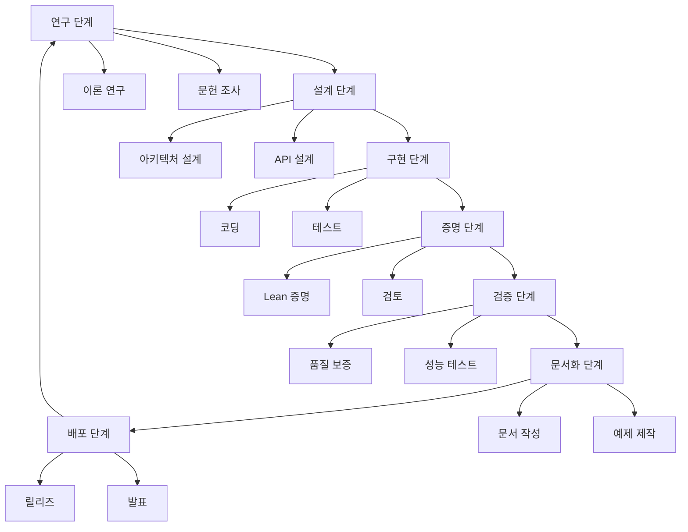

# UEM 프로젝트 구조체계 v1.0: 전체 관리 및 운영 시스템
> **목적**: UEM 프로젝트의 전체적인 구조, 역할, 프로세스, 운영 방식 정의
> **적용**: 프로젝트 시작부터 운영까지의 전체 라이프사이클
> **유지**: 지속적인 업데이트와 개선을 위한 체계

---

## 1. 프로젝트 전체 구조

### 1.1 조직 구성도
```
UEM Project Steering Committee
├── Technical Leadership
│   ├── Lead Developer (기술 아키텍처)
│   ├── Lead Prover (증명 전략)
│   └── Lead Documentation (문서 체계)
├── Development Teams
│   ├── Core Theory Team (핵심 이론)
│   ├── Implementation Team (Lean 4 구현)
│   └── Tooling Team (도구 개발)
├── Research Division
│   ├── Mathematical Research (수학 연구)
│   ├── Applied Research (응용 연구)
│   └── Education Research (교육 연구)
└── Operations
    ├── Project Management
    ├── Quality Assurance
    └── Community Management
```

### 1.2 폴더 구조체계
```
/Users/a/dev/UEM/
├── 📄 핵심 문서
│   ├── README.md                    # 프로젝트 입구
│   ├── CONSTITUTION.md             # 헌법/공통 규칙
│   ├── MANDATORY_ONBOARDING.md     # 필수 온보딩
│   ├── UEM_MASTER_COMPLETE_v1.0.md # 통합 전체 사양서
│   ├── MANAGEMENT_SYSTEM.md       # 관리 시스템
│   ├── RESEARCH_GUIDELINES.md     # 연구 개발 지침
│   └── PROJECT_STRUCTURE.md       # 프로젝트 구조체계 (본문)
│
├── 📚 문서 체계 (docs/)
│   ├── spec/                       # 수학적 스펙
│   │   ├── UEM_MATHEMATICAL_SYSTEM_SPEC_v3.1_2025-03.md
│   │   ├── UEM_CORE_FORMALISM_v0.1.md
│   │   ├── UEM_OBJECT_HIERARCHY_SPEC_v0.1.md
│   │   ├── HANGUL_OPERATORS_SPEC_v0.1.md
│   │   ├── HANGUL_LEAN_MAPPING_v0.1.md
│   │   └── UEM_ANALYTIC_PACKAGE_v0.1.md
│   ├── blueprint/                  # 설계 청사진
│   │   ├── UEM_BLUEPRINT_v1.md
│   │   ├── FINAL_INDEX.md
│   │   ├── TODO_DEPTH.md
│   │   └── THEOREM_STATEMENTS.md
│   ├── philosophy/                # 철학 기반
│   │   └── UEM_DECLARATION_ORIGINAL.md
│   ├── examples/                   # 응용 사례
│   │   └── UEM_ADVANCED_APPLICATIONS_v1.0.md
│   ├── design/                     # 설계 원칙
│   │   └── UEM_DESIGN_PRINCIPLES.md
│   ├── roadmap/                    # 발전 계획
│   │   ├── UEM_STRUCTURE_GUIDE_v0.1.md
│   │   ├── UEM_HARDENING_PLAN_v0.1.md
│   │   └── Hangul_Hyperparallel_Spec_v0.1.md
│   └── paper/                      # 학술 논문
│       └── main.tex
│
├── 💻 구현 코드 (formal/)
│   ├── UEM.lean                    # 전체 import
│   ├── Basic/                      # 기본 정의
│   │   ├── NullProjection.lean
│   │   ├── Dimensions.lean
│   │   └── Margin.lean
│   ├── Objects/                    # 객체 계층
│   │   ├── Sparke.lean
│   │   ├── Actyon.lean
│   │   ├── Escalade.lean
│   │   └── Extended.lean
│   ├── System/                     # 시스템 구조
│   │   └── Graph.lean
│   ├── Theorems/                   # 증명 결과
│   │   ├── P1_NullProjection.lean   # ✅ 완료
│   │   ├── P2_SparkeMonoid.lean      # ✅ 완료
│   │   ├── P3_ActyonStability.lean   # 🔄 진행 중
│   │   └── P4_DimensionCoherence.lean # 🔄 진행 중
│   └── Axioms/                      # 공리계
│       └── MetaRules.lean
│
├── 🔧 관리 시스템
│   ├── tasks/                       # 작업 관리
│   │   ├── database.yaml
│   │   └── current_sprint.yaml
│   ├── proofs/                      # 증명 관리
│   │   └── database.yaml
│   ├── mentoring/                   # 멘토링
│   │   ├── assignments.yaml
│   │   └── progress_tracking.yaml
│   ├── governance/                  # 거버넌스
│   │   ├── roles.yaml
│   │   └── decision_process.md
│   └── metrics/                     # 프로젝트 지표
│       └── kpi_dashboard.yaml
│
├── 🚀 자동화 도구 (scripts/)
│   ├── track_proofs.sh             # 증명 현황 추적
│   ├── verify_proofs.sh            # 증명 품질 검증
│   ├── daily_standup.sh            # 일일 스탠드업
│   ├── generate_weekly_report.sh   # 주간 리포트
│   ├── peer_review.sh              # 코드 리뷰
│   └── emergency_response.sh       # 긴급 대응
│
├── 📊 보고 및 분석
│   ├── reports/                     # 정기 보고
│   │   ├── weekly/
│   │   ├── monthly/
│   │   └── quarterly/
│   ├── reviews/                     # 검토 보고
│   │   ├── code_reviews/
│   │   └── proof_reviews/
│   └── analytics/                   # 분석 리포트
│       ├── proof_progress/
│       └── quality_metrics/
│
├── 🧪 테스트 및 품질
│   ├── tests/                       # 테스트 코드
│   ├── exercises/                   # 연습 문제
│   └── benchmarks/                  # 성능 벤치마크
│
└── 🌐 외부 인터페이스
    ├── .github/                     # GitHub 설정
    │   ├── workflows/               # CI/CD
    │   └── ISSUE_TEMPLATE/         # 이슈 템플릿
    └── website/                     # 프로젝트 웹사이트
```

---

## 2. 역할 및 책임

### 2.1 리더십 역할

#### Project Lead (프로젝트 총괄)
```yaml
responsibilities:
  - 프로젝트 전체 방향 설정
  - 주요 의사결정 최종 승인
  - 외부 협력 관리
  - 리소스 배분 및 예산 관리

authority:
  - 스펙 변경 최종 승인
  - 릴리즈 결정
  - 팀 구성 및 조직 개편

requirements:
  - 수학적 배경 (수학/물리/컴퓨터 과학)
  - 5+ 년 프로젝트 관리 경험
  - Lean 4 또는 증명 보조기 도구 경험
```

#### Lead Developer (기술 책임자)
```yaml
responsibilities:
  - 기술 아키텍처 설계
  - 개발팀 지휘 및 코딩 표준 설정
  - 코드 품질 책임
  - 기술적 문제 해결

authority:
  - 기술 표준 결정
  - 코드 리뷰 최종 승인
  - 기술 스택 선택

requirements:
  - Lean 4 전문가 수준
  - 대규모 프로젝트 경험
  - 팀 리딩 경험
```

#### Lead Prover (수학 증명 책임자)
```yaml
responsibilities:
  - 증명 전략 수립
  - 핵심 정리 증명
  - 논리적 일관성 유지
  - 수학적 타당성 검증

authority:
  - 증명 방식 결정
  - 공리계 승인
  - 증명 완성 선언

requirements:
  - 수학/논리학 박사 또는 동등 경력
  - 증명 보조기 도구 전문가
  - 논문 발표 경험
```

### 2.2 전문 팀 역할

#### Core Theory Team
```yaml
team_size: 3-5인
focus:
  - UEM 핵심 이론 개발
  - 새로운 정리 및 개념 연구
  - 수학적 타당성 확립

required_skills:
  - 순수수학/응용수학 배경
  - 형식화 증명 경험
  - 창의적 문제 해결 능력

deliverables:
  - 새로운 정리 및 증명
  - 이론적 기반 확장
  - 논문 발표
```

#### Implementation Team
```yaml
team_size: 5-8인
focus:
  - Lean 4 코드 구현
  - 증명 자동화
  - 개발 도구 제작

required_skills:
  - 프로그래밍 전문성 (Lean 4, 파이썬 등)
  - 소프트웨어 엔지니어링 경험
  - 증명 보조기 도구 활용 능력

deliverables:
  - 완전한 Lean 4 구현
  - 자동화 빌드/테스트 시스템
  - 개발 도구 및 확장
```

#### Tooling Team
```yaml
team_size: 2-3인
focus:
  - 개발 도구 개발
  - 시각화 도구 제작
  - 자동화 시스템 구축

required_skills:
  - 웹 개발 (JavaScript, React)
  - 데이터 시각화 (D3.js, WebGL)
  - DevOps 및 CI/CD

deliverables:
  - 대화형 증명 도구
  - 시각화 플랫폼
  - 자동화 빌드 시스템
```

---

## 3. 워크플로우 및 프로세스

### 3.1 전체 개발 생명주클


### 3.2 일일 운영 프로세스

#### Daily Standup (일일 스탠드업)
```bash
#!/bin/bash
# 매일 오전 9시 자동 실행
echo "UEM 일일 스탠드업 $(date)"
echo "========================="

# 1. 어제 작업 요약
echo "어제 완료:"
git log --since="1 day ago" --oneline --author="$(git config user.name)"

# 2. 오늘 계획
echo "오늘 목표:"
bash scripts/daily_standup.sh

# 3. 장애 현황
echo "현재 장애:"
grep -r "BLOCKED" tasks/ | head -5

# 4. 긴급 이슈
echo "긴급 이슈:"
gh issue list --label "priority-critical" --limit 5
```

#### Weekly Review (주간 검토)
```markdown
## UEM 주간 검토 회의

### 진행 순서
1. **성과 공유** (15분)
   - 이번 주 완료된 증명
   - 구현된 기능
   - 해결된 문제

2. **장애 논의** (15분)
   - 현재 차단 요소
   - 필요한 지원
   - 해결 방안

3. **다음 주 계획** (15분)
   - 주요 목표
   - 역할 분담
   - 마감 기한

4. **자유 토론** (15분)
   - 아이디어 공유
   - 기술적 논의
   - 협업 방안
```

### 3.3 릴리즈 관리

#### Release Cadence
```yaml
release_schedule:
  type: "time-based"
  frequency: "bi-weekly"
  day: "friday"
  time: "17:00 KST"

types:
  major: "significant architecture changes"
  minor: "new features/improvements"
  patch: "bug fixes/documentation updates"

versioning: "semantic versioning (MAJOR.MINOR.PATCH)"
```

#### Release Process
```bash
#!/bin/bash
# scripts/release_process.sh

# 1. 릴리즈 준비 검증
echo "릴리즈 준비 검증..."
bash scripts/verify_proofs.sh
bash scripts/test_coverage.sh

# 2. 버전 태그 생성
VERSION=$1
git tag -a "UEM_v$VERSION" -m "Release UEM v$VERSION"

# 3. CHANGELOG 업데이트
cat <<EOF >> CHANGELOG.md
## UEM v$VERSION ($(date +%Y-%m-%d))

### 새로운 기능
- 기능 목록
- 증명 완료 목록

### 버그 수정
- 수정된 이슈 목록

### 다음 버전 계획
- 계획된 기능 목록
EOF

# 4. GitHub 릴리즈 생성
gh release create "UEM_v$VERSION" \
  --title "UEM Release v$VERSION" \
  --notes-file CHANGELOG.md

# 5. 배포
git push origin main --tags
```

---

## 4. 품질 보증 시스템

### 4.1 코드 품질 체크리스트

#### Lean 4 코드 품질
```markdown
## Lean 4 코드 품질 검증

### 구조적 품질
- [ ] 모듈화된 구조
- [ ] 명확한 인터페이스
- [ ] 최소한의 의존성
- [ ] 재사용 가능한 코드

### 증명 품질
- [ ] sorry 없음 (0개)
- [ ] 명확한 증명 단계
- [ ] 적절한 주석
- [ ] 엣지 케이스 처리

### 문서화 품질
- [ ] 모듈 수준 문서
- [ ] 함수/정의 설명
- [ ] 사용 예시
- [ ] 관련 증명 링크
```

#### 수학적 타당성
```markdown
## 수학적 타당성 검증

### 정의 검증
- [ ] 정의의 일관성
- [ ] 기존 이론과의 호환성
- [ ] 충분한 일반성
- [ ] 필요/충분 조건 명시

### 증명 검증
- [ ] 논리적 타당성
- [ ] 완전한 증명 단계
- [ ] 올바른 참조 인용
- [ ] 동료 검토 완료

### 결과 검증
- [ ] 정리의 정확성
- [ ] 계산 예시 확인
- [ ] 특수 케이스 검증
- [ ] 성능 평가
```

### 4.2 자동화 품질 검증

#### CI/CD 파이프라인
```yaml
# .github/workflows/quality.yml
name: Quality Assurance

on: [push, pull_request]

jobs:
  build:
    runs-on: ubuntu-latest
    steps:
      - name: Checkout
        uses: actions/checkout@v3

      - name: Setup Environment
        run: |
          curl https://raw.githubusercontent.com/leanprover/elan/master/elan-init.sh -sSf | sh
          source ~/.elan/env
          lake setup

      - name: Build UEM
        run: cd formal && lake build UEM

      - name: Quality Checks
        run: |
          # sorry 검색
          if [ $(rg "sorry" formal --type lean -c) -gt 0 ]; then
            echo "❌ Found $(rg "sorry" formal --type lean -c) sorry statements"
            exit 1
          fi

          # axiom 검색
          if [ $(rg "axiom" formal --type lean -c) -gt 0 ]; then
            echo "⚠️  Found $(rg "axiom" formal --type lean -c) axioms"
          fi

          # 빌드 테스트
          lake test

      - name: Documentation Build
        run: |
          cd docs
          npm ci
          npm run build

      - name: Performance Benchmark
        run: |
          cd formal
          time lake build UEM

      - name: Coverage Report
        run: |
          bash scripts/generate_coverage_report.sh
```

---

## 5. 커뮤니티 및 외부 협력

### 5.1 오픈소스 커뮤니티 관리

#### 기여자 가이드라인
```markdown
## UEM 기여자 가이드

### 기여 방법
1. **이슈 제기**: 버그 리포트, 기능 요청, 질문
2. **풀 리퀘스트**: 코드 제출, 증명 개선, 문서 확장
3. **토론 참여**: 이론 논의, 설계 제안, 아이디어 공유

### 기여자 유형
- **Core Contributors**: 핵심 개발자 (권한 있음)
- **Regular Contributors**: 정기적 기여자 (승인 권한)
- **Community Contributors**: 일회성 기여자

### 기여자 인정
- GitHub 기여자 목록 표시
- 발표/논문 공동저자 기회
- UEM 커뮤니티 행사 초대
```

#### 외부 협력 프로세스
```bash
#!/bin/bash
# scripts/collaboration_setup.sh

# 외부 협력자 온보딩
COLLABORATOR=$1

echo "외부 협력자 설정: $COLLABORATOR"

# 1. GitHub 접근 권한
gh organization add-member uem-math $COLLABORATOR --role "collaborator"

# 2. 개발 환경 설정
echo "개발 환경 안내서 발송:"
cat <<EOF
안녕하세요 $COLLABORATOR님,

UEM 프로젝트에 참여해주셔서 감사합니다.

개발 환경 설정 가이드:
1. Lean 4 설치: https://lean-lang.org/
2. 프로젝트 클론: git clone https://github.com/uem-math/UEM.git
3. 환경 설정: cd UEM && lake setup
4. 빌드 테스트: cd formal && lake build UEM

문의처:
- GitHub Issues: https://github.com/uem-math/UEM/issues
- 토론: https://github.com/uem-math/UEM/discussions
- 이메일: team@uem-math.org

UEM 팀 드림
EOF

# 3. 멘토링 할당
echo "멘토 할당..."
python scripts/assign_mentor.py $COLLABORATOR
```

### 5.2 학술적 협력

#### 대학/연구소 파트너십
```yaml
academic_partnerships:
  universities:
    - name: "서울대학교 수리과학과"
      collaboration_type: "이론 연구"
      contact: "prof.kim@snu.ac.kr"

    - name: "KA 전산과학과"
      collaboration_type: "구현 도구 개발"
      contact: "prof.lee@kaist.ac.kr"

  research_institutes:
    - name: "KIAS 수리부"
      collaboration_type: "순수수학 연구"
      contact: "research@kias.re.kr"
```

#### 학술 컨퍼런스 참여
```markdown
## UEM 학술 활동

### 정기 참여 컨퍼런스
- **ICMS**: 증명 보조기 도구
- **IJCAR**: 자동화 추론
- **Lean Together**: Lean 커뮤니티

### 워크샵 및 튜토리얼
- **UEM Summer School**: 매년 7월
- **Lean 4 Workshop**: 격월 개최
- **Proof Assistant Tutorial**: 온라인 정기 진행

### 발표 자료
- 튜토리얼 비디오: YouTube 채널
- 슬라이드 자료: Google Drive
- 논문 프리프린트: arXiv
```

---

## 6. 지속적 개선 및 성장

### 6.1 프로젝트 성장 전략

#### 단계별 성장 계획
```yaml
growth_phases:
  phase_1_foundation: # 0-1년
    goals:
      - 핵심 이론 완성 (80%)
      - Lean 4 기반 구축 (100%)
      - 기초 문서 정비 (100%)
    team_size: 5-8인
    target_metrics:
      - proved_theorems: 20개
      - sorry_count: 50개 이하

  phase_2_expansion: # 1-3년
    goals:
      - 이론 확장 및 응용
      - 교육 시스템 구축
      - 커뮤니티 성장
    team_size: 10-15인
    target_metrics:
      - proved_theorems: 100개
      - community_contributors: 50+인

  phase_3_maturity: # 3-5년
    goals:
      - 독립된 수학 분과 인정
      - 교육 기관 채택
      - 상용화 도구 개발
    team_size: 20-30인
    target_metrics:
      - academic_adoption: 5+ 기관
      - commercial_tools: 3+ 개
```

### 6.2 성과 측정 및 평가

#### 핵심 성과 지표 (KPI)
```yaml
development_kpis:
  proof_completion:
    target: "80% 이상 증명 완료"
    measurement: "proved_theorems / total_theorems"

  code_quality:
    target: "sorry 개수 10개 이하"
    measurement: "rg 'sorry' --type lean | wc -l"

  documentation_coverage:
    target: "95% 이상"
    measurement: "documented_modules / total_modules"

research_kpis:
  academic_publications:
    target: "년 10편 이상"
    measurement: "게재 논문 수"

  conference_presentations:
    target: "년 15회 이상"
    measurement: "발표 횟수"

  community_growth:
    target: "월 5% 성장"
    measurement: "GitHub stars / contributors"

education_kpis:
  educational_materials:
    target: "대학 수준 교재 5종"
    measurement: "완성된 교재 수"

  student_participation:
    target: "년 100명 학생 참여"
    measurement: "프로젝트 참여 학생 수"
```

---

## 7. 위험 관리 및 비상 계획

### 7.1 기술적 위험
```yaml
technical_risks:
  lean_version_compatibility:
    probability: "medium"
    impact: "high"
    mitigation:
      - 정기적 업데이트 테스트
      - 버전 호환성 레이어
      - 롤백 계획 수립

  proof_complexity_explosion:
    probability: "high"
    impact: "medium"
    mitigation:
      - 증명 모듈화
      - 자동화 도구 개발
      - 단순화 기법 연구

  community_fragmentation:
    probability: "low"
    impact: "high"
    mitigation:
      - 명확한 개발 방향
      - 정기적 동기화
      - 커뮤니티 포럼 활성화
```

### 7.2 비상 계획
```bash
#!/bin/bash
# scripts/emergency_plan.sh

EMERGENCY_TYPE=$1

case $EMERGENCY_TYPE in
  "key_developer_departure")
    echo "핵심 개발자 이탈 비상 계획"

    # 1. 지식 전담
    bash scripts/knowledge_transfer.sh

    # 2. 대체 인력 충원
    bash scripts/recruitment_emergency.sh

    # 3. 타임라인 조정
    bash projects/reschedule_timeline.sh
    ;;

  "critical_blocker")
    echo "치명적 차단 요소 비상 계획"

    # 1. 문제 분석
    bash scripts/analyze_blocker.sh

    # 2. 전문가 컨설팅
    bash scripts/consult_experts.sh

    # 3. 대안 방안 모색
    bash scripts/explore_alternatives.sh
    ;;

  "community_crisis")
    echo "커뮤니티 위기 비상 계획"

    # 1. 투명한 소통
    bash scripts/transparent_communication.sh

    # 2. 갈등 조정
    bash scripts/escalation_handling.sh

    # 3. 복구 계획
    bash scripts/community_recovery.sh
    ;;
esac
```

---

## 8. 성공 지표 및 미션

### 8.1 장기 목표
```markdown
## UEM 장기 미션 (5년 계획)

### 학문적 목표
- 독립된 수학 분과로 인정받기
- 주요 수학 저널에 논문 게재
- 국제 학회에서 규칙 세션 확보

### 교육적 목표
- 5개 대학에서 정규 과목 개설
- UEM 중심 연구소 설립
- 100명 이상의 전문가 양성

### 기술적 목표
- 상업화 가능한 도구 출시
- 오픈소스 커뮤니티 1,000+명
- 실제 문제 해결 사례 50+개
```

### 8.2 단기 성공 지표 (1년)
```yaml
quarterly_targets:
  Q1_2025:
    - P3-P4 정리 증명 완료
    - 한글 연산자 LUT 완성
    - 문서 체계 정비

  Q2_2025:
    - 차원 독립성 증명 10개
    - 교육용 예제 50개
    - 시각화 도구 베타 버전

  Q3_2025:
    - KM-1~3 증명 시작
    - 학술 워크샵 개최
    - 오픈소스 커뮤니티 100명

  Q4_2025:
    - 첫 논문 제출
    - 대학 시범 강의
    - v2.0 릴리즈
```

---

이 프로젝트 구조체계를 통해 UEM 프로젝트가 체계적으로 관리되고, 모든 기여자가 명확한 역할과 프로세스를 통해 효과적으로 협력할 수 있을 것입니다. 지속적인 개선과 성장을 통해 UEM이 독립된 수학 분과로 성장할 수 있는 기반을 마련했습니다.